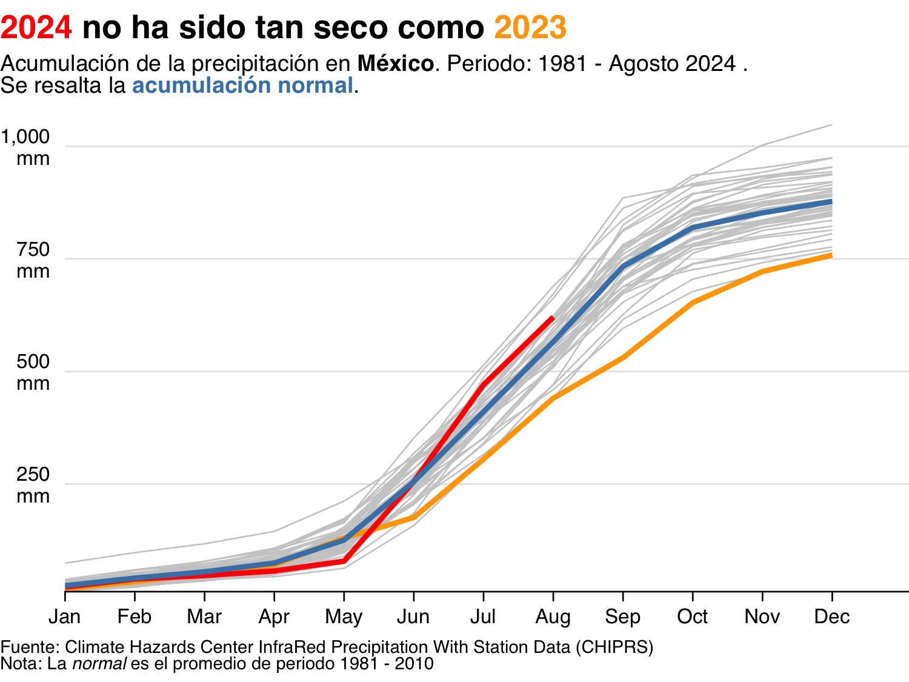
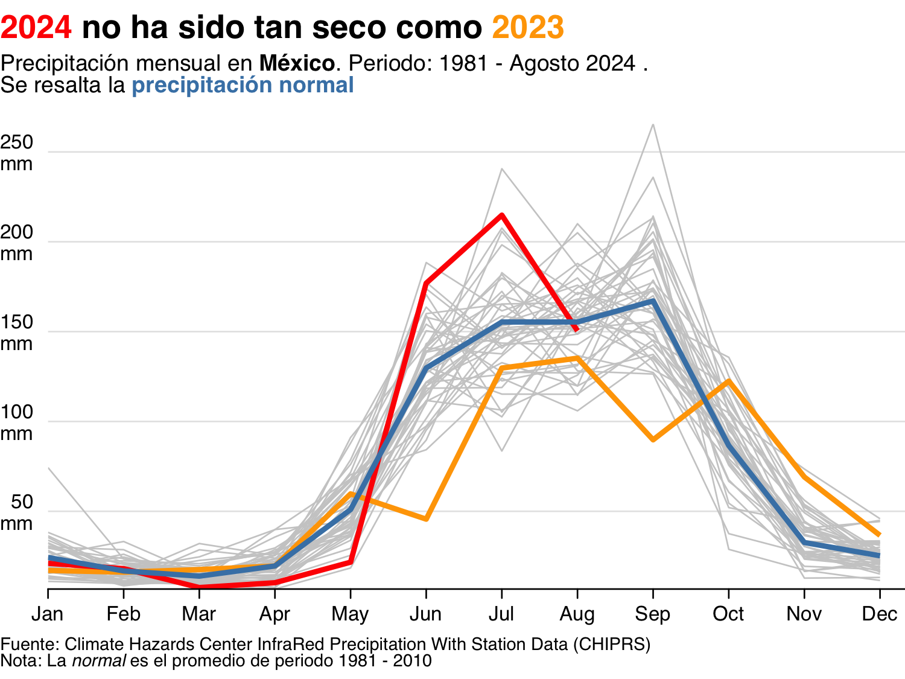

# CHIRPS: Extracción y procesamiento de datos de lluvia II

- [1 01](#01)
- [2 02](#02)
- [3 03](#03)
- [4 04](#04)
- [5 05](#05)

## 01

Lorem ipsum dolor sit amet, consectetur adipiscing elit. Aenean eu purus mattis, ultrices enim eget, efficitur nisl. Nulla ipsum purus, efficitur non dignissim eget, consectetur a erat. Vestibulum ante ipsum primis in faucibus orci luctus et ultrices posuere cubilia curae; Vivamus feugiat finibus urna, vel fermentum tortor sagittis eu. Vestibulum ultrices, nunc quis mollis fermentum, nibh odio finibus ante, at scelerisque turpis neque sed odio. Praesent ullamcorper velit dui, sed ultricies ex eleifend id. Fusce molestie massa tempus odio ultrices, quis dignissim libero maximus. Proin posuere vestibulum eros, at aliquam tellus convallis in. Nunc a dictum mauris. Proin tincidunt erat erat, vitae vulputate mi placerat vitae. Aenean scelerisque, turpis a varius congue, diam mi consectetur metus, eu pulvinar dui nisl nec neque.

## 02

Suspendisse egestas elementum convallis. Praesent cursus dictum magna, non lacinia nibh vehicula et. Ut auctor congue tellus eu interdum. Nam non blandit odio, non pretium dolor. Vestibulum facilisis tincidunt elit, in ornare dolor pulvinar id. Vivamus id purus in nisl varius posuere at id nunc. Fusce id lacus porta, euismod tellus a, tincidunt tortor. Sed euismod turpis id urna iaculis, sit amet iaculis justo efficitur. In sollicitudin est eu venenatis tincidunt. Maecenas commodo neque tincidunt purus vulputate, et congue augue tempor. Nulla non ullamcorper arcu. Aliquam sed dolor fermentum, ornare leo sit amet, pretium turpis. In pretium posuere libero id rhoncus. Fusce vestibulum, nulla ut porttitor pretium, felis sapien pretium arcu, ac convallis massa lacus sit amet ligula.

## 03

Interdum et malesuada fames ac ante ipsum primis in faucibus. Sed dui felis, suscipit a felis ac, venenatis ultrices erat. Nulla semper mauris eu justo vulputate vulputate. Morbi nibh eros, elementum in risus quis, malesuada commodo ante. Vivamus tincidunt dui id sollicitudin cursus. Quisque a aliquam erat. Cras lobortis suscipit massa nec vulputate.

## 04

Fusce ultrices posuere nulla eget ultricies. Vivamus lorem nibh, varius nec commodo id, dignissim at eros. Phasellus vitae elit eros. Etiam in aliquet ex. Nullam ut posuere quam, vitae scelerisque diam. Sed porta, nibh nec imperdiet luctus, mi orci volutpat est, id laoreet elit metus ut quam. Pellentesque ut sem arcu. Suspendisse condimentum nec mi egestas imperdiet.

## 05

Donec gravida dolor augue, eu consequat nisi bibendum eget. Etiam facilisis varius urna vitae hendrerit. Pellentesque maximus orci vitae sem fringilla, a congue nisi tristique. Phasellus molestie metus vitae tempus varius. Nulla quis ornare lectus. Nam congue sapien sed lorem efficitur ullamcorper. Ut ex turpis, pellentesque vitae augue et, tempor fermentum est.
